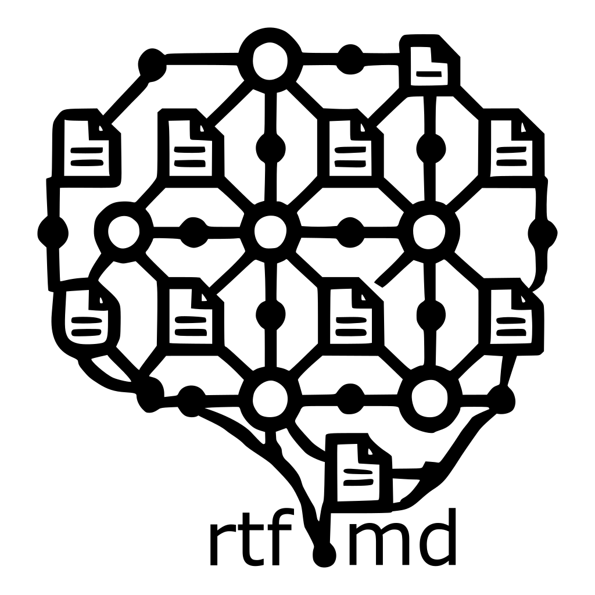

# rtf.md – Reasoning Trace Framework through Markdown

<p align="center">
  
</p>

## Project Vision

rtf.md creates a cognitive substrate for code repositories, enabling language models to understand, evolve, and reason about software at a deeper level than ever before possible. By maintaining a parallel shadow file system with comprehensive reasoning traces, rtf.md transforms repositories from collections of instructions into knowledge networks with explicit thought processes.

This framework isn't just documentation — it's machine-accessible memory and reasoning that scales with the ever-increasing capabilities of language models. As context windows expand and reasoning becomes more sophisticated, the value of this cognitive layer grows exponentially.

## The Cognitive Substrate

For every file in a repository, rtf.md maintains a corresponding reasoning trace file in a centralized `rtfmd/` directory. These shadow files capture the complete cognitive history of the code:

- The thought processes that led to its creation
- The mental models that informed its design
- The trade-offs considered and rejected
- The domain knowledge applied
- The evolution of understanding over time

Language models use this cognitive substrate to understand code at a human level, enabling them to make more informed suggestions, identify deeper patterns, and maintain a comprehensive understanding of the system's evolution.

## Repository Structure

```plaintext
repository/
├── src/
│   ├── components/
│   │   └── Button.jsx
│   └── utils/
│       └── formatDate.js
├── rtfmd/
│   ├── files/
│   │   ├── src/
│   │   │   ├── components/
│   │   │   │   └── Button.jsx.md
│   │   │   └── utils/
│   │   │       └── formatDate.js.md
│   ├── knowledge/
│   │   ├── frontend/
│   │   │   └── react-component-patterns.md
│   │   ├── security/
│   │   │   └── authentication-best-practices.md
│   │   └── standards/
│   │       └── code-style-guide.md
│   └── decisions/
│       └── auth-strategy.md
└── README.md
```

- **rtfmd/files/**: The shadow file system that mirrors the repository's structure
- **rtfmd/knowledge/**: Domain-specific knowledge repository linked to from file-level reasoning traces
- **rtfmd/decisions/**: Architectural and design decisions that impact multiple components

## Architectural Decision Records in rtf.md

The `rtfmd/decisions/` directory incorporates and extends the concept of Architectural Decision Records (ADRs) within the rtf.md framework. While traditional ADRs capture high-level design decisions as standalone documents, rtf.md integrates them into the broader cognitive substrate:

```markdown
<metadata>
  title: Authentication Strategy
  author: tech-lead-789
  timestamp: 2025-02-10T09:15:00Z
  status: accepted
  related-files: [/src/auth/, /src/api/middleware/auth.js]
</metadata>

<context>
  Our application needs to support both third-party OAuth providers and traditional
  username/password authentication. We need to determine the optimal approach
  that balances security, maintainability, and user experience.
</context>

<decision>
  Implement a unified authentication service that abstracts provider-specific
  logic behind a common interface. Use JWT for session management with short
  expiration times and secure refresh token rotation.
</decision>

<alternatives>
  1. Separate authentication paths for each provider
  2. Session-based authentication with cookies
  3. Delegating auth entirely to a third-party service
</alternatives>

<reasoning>
  The unified approach gives us flexibility to add new providers without
  changing the core authentication flow. JWT allows for stateless authentication
  which improves scalability.
</reasoning>

<consequences>
  - More complex initial implementation
  - Better long-term maintainability
  - Requires careful token management
  - Enables future identity federation
</consequences>

<knowledge-refs>
  [OWASP Authentication Best Practices](/rtfmd/knowledge/security/owasp-auth.md) - Last updated 2025-01-15
  [JWT Security Considerations](/rtfmd/knowledge/security/jwt-security.md) - Last updated 2025-01-03
</knowledge-refs>
```

These architectural decisions are:

1. **Connected to Implementation**: Directly linked to the files they impact
2. **Part of the Knowledge Graph**: Referenced from relevant file-level reasoning traces
3. **Living Records**: Updated as architectural understanding evolves
4. **Enhanced with Context**: Include links to knowledge documents that informed the decision

By integrating ADRs into the rtf.md framework, architectural decisions become part of the continuous cognitive substrate rather than isolated documents. This allows language models to understand how high-level design choices influence specific implementation details throughout the codebase.

## Language Model Integration

rtf.md is designed for bidirectional interaction with language models:

1. **LMs as Consumers**: When a language model encounters a repository with an `rtfmd/` folder, it gains access to the complete reasoning context, enabling deeper understanding of code purpose and design.

2. **LMs as Maintainers**: Language models can automatically generate and update reasoning traces as code evolves, ensuring the cognitive layer remains current with the codebase.

This creates a virtuous cycle where better context leads to better understanding, which leads to more accurate reasoning, which leads to better code and documentation.

## Comprehensive Tag System

The rtf.md tag system creates a structured representation of human reasoning processes that language models can parse and extend:

### Metadata Tags
```markdown
<metadata>
  author: [Author Name/ID]
  timestamp: [ISO DateTime]
  version: [Version]
  related-files: [List of related files]
  prompt: [Original request/prompt that led to this code]
  requestor: [Human/LM who requested the change]
  requestor-context: [Urgency, mood, constraints of request]
</metadata>
```

### Process Tags
```markdown
<exploration>
  [Initial approaches considered]
  [Thought processes during exploration]
  [Resources consulted]
</exploration>

<attempt>
  [Implementation attempts with rationale]
  [What worked and what didn't]
</attempt>

<debugging>
  [Debugging process]
  [Issues encountered and how they were identified]
  [Solutions tried]
</debugging>

<refactor-reason>
  [Why code was refactored]
  [What improved after refactoring]
</refactor-reason>
```

### Issue Tags
```markdown
<bug>
  [Bug description]
  [Root cause analysis]
  [Fix implementation]
</bug>

<edge-case>
  [Edge case description]
  [How it was discovered]
  [Implementation approach]
</edge-case>

<technical-debt>
  [Shortcuts taken]
  [Justification]
  [Future improvement plan]
</technical-debt>

<performance-bottleneck>
  [Performance issue identified]
  [Analysis process]
  [Optimization strategy]
</performance-bottleneck>
```

### Reasoning Tags
```markdown
<assumption>
  [Critical assumptions made]
  [Validation approach]
</assumption>

<trade-off>
  [Options considered]
  [Trade-offs made]
  [Justification for choices]
</trade-off>

<constraint>
  [System constraints affecting decisions]
  [How constraints were addressed]
</constraint>

<insight>
  [Key realizations]
  [How they affected implementation]
</insight>
```

### Human Priors Tags
```markdown
<domain-knowledge>
  [Specialized knowledge applied]
  [Industry-specific considerations]
  [How domain expertise influenced decisions]
</domain-knowledge>

<mental-model>
  [Conceptual frameworks used]
  [How mental models guided implementation]
  [Evolution of understanding during development]
</mental-model>

<intuition>
  [Gut feelings that influenced decisions]
  [How intuition was validated or disproven]
  [Experience-based shortcuts taken]
</intuition>
```

### Context Tags
```markdown
<dependency-issue>
  [Problems with dependencies]
  [Workarounds implemented]
</dependency-issue>

<breaking-change>
  [Breaking changes made]
  [Migration strategy]
</breaking-change>

<legacy-accommodation>
  [Legacy code accommodations]
  [Challenges and solutions]
</legacy-accommodation>
```

### Code Quality Tags
```markdown
<code-convention>
  [Coding standards followed]
  [Style decisions made]
  [Linting considerations]
</code-convention>

<testing-strategy>
  [Test approach chosen]
  [Coverage considerations]
  [Edge cases specifically tested]
</testing-strategy>

<security>
  [Security considerations]
  [Vulnerability mitigations]
  [Authentication/authorization decisions]
</security>
```

### Collaboration Tags
```markdown
<code-review-feedback>
  [Feedback received]
  [Changes made in response]
  [Justification for accepting/rejecting feedback]
</code-review-feedback>

<pair-programming>
  [Collaborative insights]
  [Role distribution]
  [Consensus building process]
</pair-programming>
```

### Learning Tags
```markdown
<pattern-recognition>
  [Design patterns identified]
  [How patterns were applied]
  [Pattern adaptation details]
</pattern-recognition>

<knowledge-gap>
  [Areas where knowledge was lacking]
  [How information was obtained]
  [Learning resources used]
</knowledge-gap>
```

### Emotional/Situational Tags
```markdown
<frustration>
  [Sources of frustration]
  [How they were overcome]
</frustration>

<uncertainty>
  [Areas of uncertainty]
  [How decisions were made despite uncertainty]
</uncertainty>

<pressure>
  [Time or other pressures]
  [Impact on implementation]
</pressure>

<aha-moment>
  [Breakthrough realizations]
  [How they changed the approach]
</aha-moment>
```

### Future-Oriented Tags
```markdown
<todo>
  [Pending tasks]
  [Priority level]
</todo>

<known-limitation>
  [Known limitations]
  [Potential future solutions]
</known-limitation>

<follow-up>
  [Follow-up work needed]
  [Dependencies and prerequisites]
</follow-up>
```

### Knowledge Reference Tags
```markdown
<knowledge-refs>
  [Link to relevant knowledge document](/rtfmd/knowledge/domain/document.md) - Last updated YYYY-MM-DD
  [Link to architectural decision](/rtfmd/decisions/decision-record.md) - Last updated YYYY-MM-DD
</knowledge-refs>
```

## The Knowledge Repository

The knowledge directory serves as a central hub for domain expertise, established patterns, and architectural decisions. Unlike traditional documentation, these knowledge documents are:

1. **Living**: Updated as understanding evolves
2. **Connected**: Linked directly from reasoning traces
3. **Contextual**: Provide background for specific code decisions
4. **Temporal**: Include timestamp information to understand what was known when

This creates a knowledge graph that language models can traverse to understand not just how code works, but why it works that way based on the available knowledge at the time of writing.

## Usage Example

A reasoning trace for a bug fix:

```markdown
<metadata>
  author: developer-id-123
  timestamp: 2025-03-15T14:32:00Z
  prompt: "Fix authentication failure on mobile devices"
  requestor: product-manager-456
  requestor-context: "High priority, customers are reporting login failures"
</metadata>

<bug>
  Mobile authentication fails when device is in landscape orientation.
  Root cause: Input validation assumes portrait dimensions.
  Fix: Implemented responsive validation that adapts to device orientation.
</bug>

<debugging>
  Initially suspected JWT token expiration.
  Logs showed valid tokens being rejected.
  Device testing revealed orientation correlation.
  Traced to validation function in auth_helper.js.
</debugging>

<edge-case>
  Tablets with unusual aspect ratios were still failing.
  Added dedicated tablet detection logic.
</edge-case>

<intuition>
  Had a hunch that the orientation might be related because similar issues
  occurred in previous projects with responsive designs.
  Validated by testing in both orientations explicitly.
</intuition>

<domain-knowledge>
  Mobile browsers handle viewport dimensions differently in landscape mode.
  iOS Safari in particular reports window.innerHeight inconsistently.
  This is a known issue in responsive design for authentication forms.
</domain-knowledge>

<knowledge-refs>
  [Mobile Viewport Best Practices](/rtfmd/knowledge/frontend/mobile-viewport.md) - Last updated 2025-01-10
  [Authentication Strategy](/rtfmd/decisions/auth-strategy.md) - Last updated 2025-02-10
</knowledge-refs>

<follow-up>
  Need comprehensive testing across device types.
  Consider refactoring entire validation module.
</follow-up>
```

## Implementation

To implement rtf.md in your repository:

1. Create the initial directory structure:
   ```bash
   mkdir -p rtfmd/files rtfmd/knowledge rtfmd/decisions rtfmd/assets
   ```

2. Add your logo to the assets directory:
   ```bash
   # Save your logo as rtfmd/assets/rtfmd-logo.png
   ```

3. Configure your language models to recognize and interact with the `rtfmd` folder structure
4. Begin documenting reasoning traces for your most critical files
5. Gradually expand coverage across your codebase

## Transformative Benefits

1. **Continuous Knowledge Transfer**: Expertise is preserved and accessible to all current and future contributors
2. **Enhanced Language Model Performance**: LMs generate more accurate code by understanding the deeper context
3. **Reduced Technical Debt**: Implicit knowledge becomes explicit and maintainable
4. **Accelerated Onboarding**: New team members can understand not just what code does, but why it exists
5. **Future-Proof Development**: As LM capabilities grow, the value of the cognitive substrate increases

## Contributing

Contributions to rtf.md are welcome! We're particularly interested in:
- Real-world implementation experiences
- Additional tag suggestions based on development scenarios
- Tools for LM integration with the framework
- Case studies demonstrating improved code quality and understanding

## License

This project is licensed under the MIT License - see the LICENSE file for details.
